# CSS/Sass Notes ⚡️

## Live Demo
Check out the [Website here.](https://crperz.github.io/adventour)

## Three Pilars
<p align="center">
  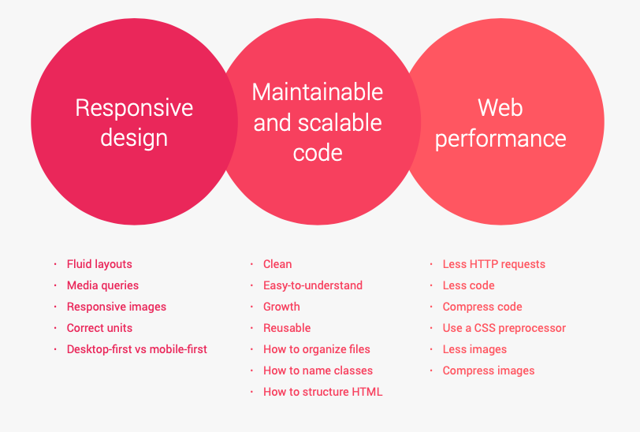
</p>

---

## Cascade and Specificity
Process of combining different style sheets and resolving conflicts between different CSS rules and declarations, when more than one rule applies to a certain element.

### Author Declarations
CSS that we the developers write, declarations that we put in style sheets are called Author Declarations.

### User Declarations
CSS coming from the user, i.e. When the user changes the font size in the browser, then this is User CSS.

### Browser Declarations (User Agent)
Default style in elements, i.e. anchor tag (blue and underline).

## Importance > Specificity > Source Order

### Importance (1 > ... > 5)
1. User !important declarations.
2. Author !important declarations.
3. Author declarations.
4. User declarations.
5. Default browser declarations.

Same importance? &rarr;

### Specificity (1 > ... > 4)
1. Inline styles.
2. IDs.
3. Classes, pseudo-classes, attribute.
4. Elements, pseudo-elements.

<p align="center">
  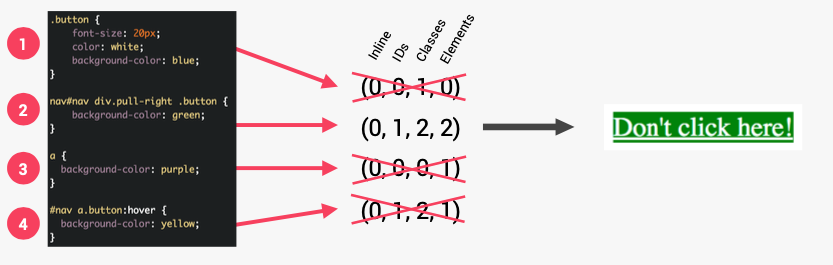
</p>

Same specificity? &rarr;

### Source Order (1 > ... > 5)
The last declaration in the code will override all other declarations and will be applied.

### Notes
* CSS declarations marked width !important have the highest priority.
* Only use !important as a last resource. It's better to use correct specifies - **more maintainable code!**
* The universal selector * has no specificity value (0,0,0,0).
* Rely more on **specificity** than on the **order** of selectors.
* But, rely on order when using 3rd-party style sheets -- always put your author style sheet last.

---

## Value Processing
CSS Engine converts relative units to pixels.
```css
html, body {
  font-size: 16px;
  width: 80vw;
}

header {
  font-size: 150%;
  padding: 2em;
  margin-bottom: 10rem;
  height: 90vh;
  width: 1000px;
}

.header-child {
  font-size: 3em;
  padding: 10%;
}
```
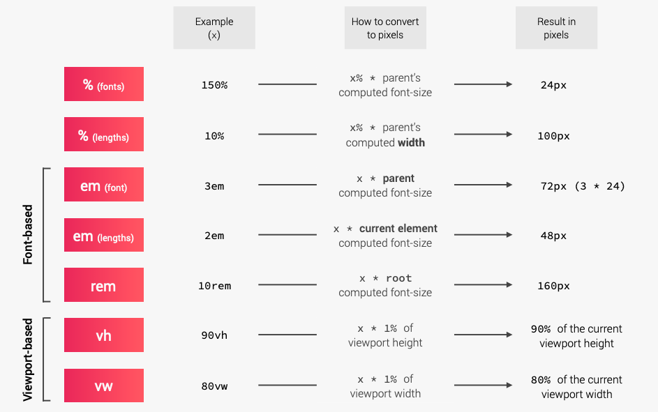

### Notes
**Why should we actually size stuff with ems and rems if they are based on font-size?**
We can build more robust responsive layouts because just by changing font sizes, we will automatically change length since it depend on a font size. That gives us a lot of flexibility.

* Each property has an initial value, used if nothing is declared (and if there is no inheritance).
* Browsers specify a **root font-size** for each page (usually 16px - user agent definition).
* Percentages and relative values are always converted to pixels.
* Percentages are measured relative to their parent's **font-size**, if used to specify font-size.
* Percentages are measured relative to their parent's **width**, if used to specify lengths.
* em are measured relative to their **parent** font-size, if used to specify font-size.
* em are measured relative to the **current** font-size, if used to specify lengths.
* rem are always measured relative to the **document's root** font-size (default: 16px &rarr; 1rem).
* vh and vw are simply percentage measurements of the viewports height and width.

---

## Inheritance
* Inheritance passes the values for some specific properties from parents to children - more maintainable code.
* Properties related to text are inherited. font-family, font-size, color, etc.
* Inheritance of a property only works if no one declares a value for that property.
* The inherit keyword forces inheritance on a certain property.
* The initial keyword resets a property to its initial value.

---

## The Visual Formatting Model
Algorithm that calculates boxes and determines the layout of theses boxes, for each element in the render tree, in order to determine the final layout of the page.

In order to do this, the algorithm takes into account:
* **Dimensions of boxes**: the box model.
* **Box type**: inline, block and inline-block.
* **Positioning scheme**: floats and positioning. (absolute - relative)
* **Stacking** contexts.
* Other elements in the render tree.
* Viewport size, dimensions of images, etc.

### The Box Model
* **Content**
* **Padding**
* **Border**
* **Margin**
* **Fill area**: area that gets filled with background color or background image.
<p align="center">
  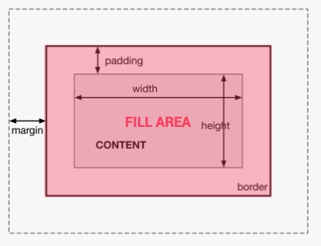
</p>

### Heights and Widths
<p align="center">
  Total width: right border + right padding + specified width + left padding + left border
</p>
<p align="center">
  Total height: top border + top padding + specified height + bottom padding + bottom border
</p>

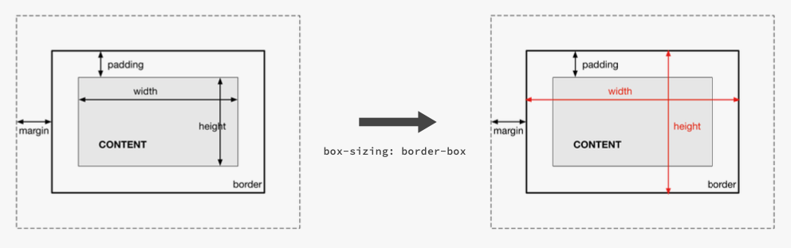
```css
/* default: content-box */
element {
  box-sizing: border-box;
}
```
Example:
<p align="center">
  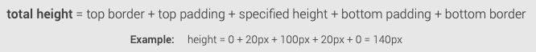
</p>
<p align="center">
  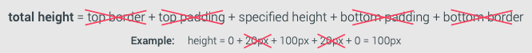
</p>

### Box Types
<p align="center">
  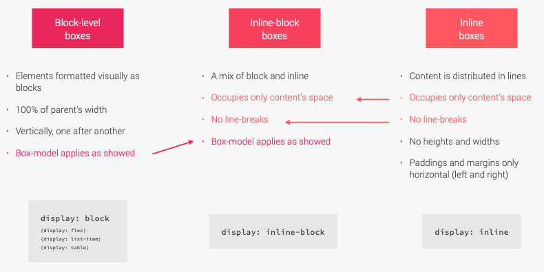
</p>

### Position Schemes
<p align="center">
  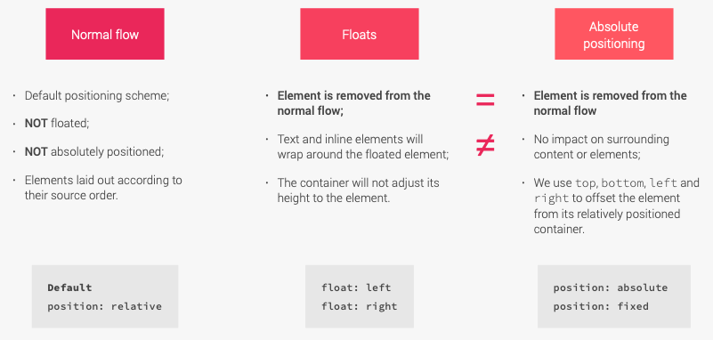
</p>

### Stacking Contexts
<p align="center">
  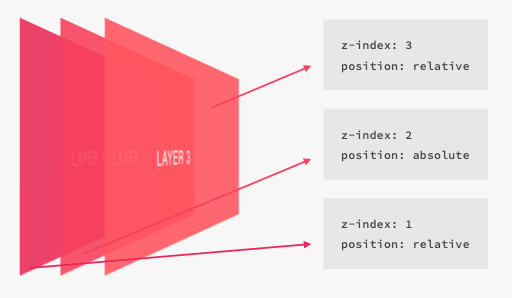
</p>

---

## The Think-Build-Architect Mindset
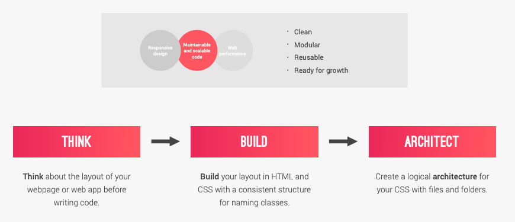

### Think
#### Component-Driven Design
* **Modular building blocks** that make up interfaces.
* Held together by the **layout** of the page.
* **Re-usable** across a project, and between different projects.
* **Independent**, allowing us to use them anywhere on the page.
#### Atomic Design
> We’re not designing pages, we’re designing systems of components.—Stephen Hay
<p align="center">
  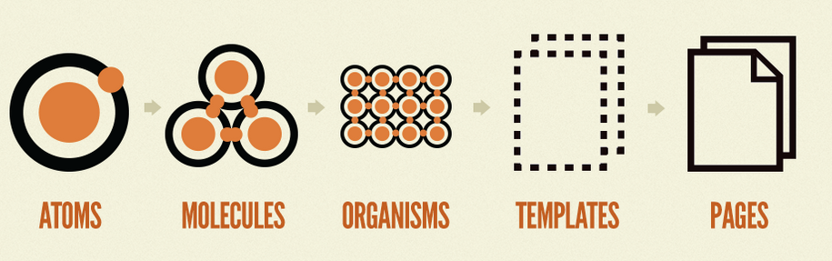
</p>

### Build
Building with meaningful class names.
<p align="center">
  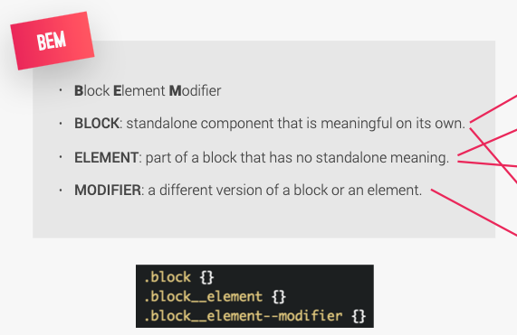
</p>

### Architect
#### The 7-1 Pattern
7 different folders for partial Sass files, and 1 main Sass file to import all other files into a compiled CSS stylesheet.
<p align="center">
  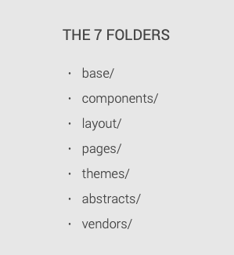
</p>

* **base**: Which is where we're going to put our basic projects definitions as project boilerplate.
  * Base partial (_base.scss): This file will be for the real low level basics, such as resets and styles. This file should be a partial. Partial files always start with an underscore.
  * Animations, typography, utilities partials.
* **abstract**: We're only going to put code that's not going to output any CSS: Variables, mixins, functions and stuff like that.
* **components**: We're going to create one file for each component. Components: Reusable building blocks that make up our website, which are independent and reusable everywhere across our website.
* **layout**: For each piece of the global layout of the entire project (global footer, header, etc).
* **pages**: Specific styles for a specific page.
* **themes**: For web apps with different themes.
* **vendors**: Where we can put third party CSS. i.e. bootstrap, icon system, animation framework.

---

## Sass
Sass is a CSS preprocessor, an extension of CSS that adds power and elegance to the basic language.
<p align="center">
  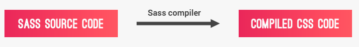
</p>

### Main Features
* **Variables**: for reusable values such as colors, font-sizes, spacing, etc.
* **Nesting**: to nest selectors inside of one another, allowing us to write less code.
* **Operators**: for mathematical operations right inside of CSS.
* **Partials and imports**: to write CSS in different files and importing them all into one single file.
* **Mixins**: to write reusable pieces of CSS code.
* **Functions**: similar to mixins, with the difference that they produce a value that can be used.
* **Extends**: to make different selectors inherit declarations that are common to all of them.
* **Control directives**: for writing complex code using conditionals and loops.

### Sass and Scss
<p align="center">
  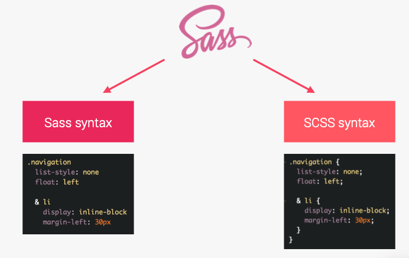
</p>

---

## Basic Responsive Design Principles

### Fluid Grids and Layouts
To allow content to easily adapt to the current viewport width used to browse the website. Uses **%** rather than **px** for all layout-related things.

### Flexible/Responsive Images
Images behave differently than text content, and so we need to ensure that they also adapt nicely to the current viewport. Make images flexible by defining their dimensions in percentages rather than fixed units like pixels. Images usually make up the biggest part of our website's size, in terms of megabytes, and so we should optimize the images for different width.

### Media Queries
To change styles on certain viewport widths (breakpoints), allowing us to create different version of our website for different widths.

---

## Layout Types
Three major ways of laying out a webpage or app.
1. **Float Layouts (OLD)**: Simply put a bunch of boxes side by side using floats.
2. **Flexbox**: Offers an amazing way of laying out elements in a one dimensional row.
3. **CSS GRID**: Is perfect for creating the overall layout of a page in a fully-fledged 2D grid.

---

## Responsive Design Strategies

### Desktop-First
* Start writing CSS for the desktop: large screen.
* Then, media queries shrink design to smaller screens.
* Use max-width: maximum width at which media query still applies (max-width: 600px is width <= 600px).

### Mobile-First
* Start writing CSS for mobile devices: small screen.
* Then, media queries expand design to a large desktop screen.
* Forces us to reduce websites and apps to the absolute essentials.
* Use min-width: minimum width at which media query starts to apply (min-width: 600px is width >= 600px).

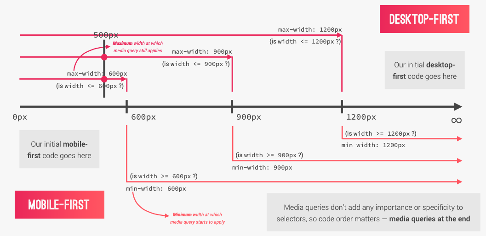

### Is Mobile-First right for you?
#### PROS
* 100% optimised for the mobile experience.
* Reduces websites and apps to the absolute essentials.
* Results in smaller, faster and more efficent products.
* Prioritizes content over aesthetic design, which may be desirable.
#### CONS
* The desktop version might feel overly empty and simplistic.
* More difficult and counterintuitive to develop.
* Less creative freedom, making it more difficult to create distinctive products.
* Clients are used to see a desktop version of the site as a prototype.
* Do you users even use the mobile internet? What's the purpose of your website?

> NO MATTER WHAT YOU DO, ALWAYS KEEP BOTH DESKTOP AND MOBILE IN MIND

### Selectiong our Breakpoints: The options

#### Bad Way
The most used way of choosing breakpoints. It consists of simply using the width of popular devices as the breakpoints. Commonly the designers like to use Apple products. (Problem: If Apple decides to change the resolution of device then you need to change all the mdeia queries).

#### Good Way
We look at all the most-used devices width on the entire internet, try to group them together in a logical way and then pick our breakpoints from that.

#### Perfect Way
Is to ignore devices all together and only look at your content and tour design. If your design no longer looks okay or starts to look weird and out of the place then insert a new breakpoint. This approach is extremely difficult.

### Breakpoints based on StatCounter:
* Phone : 0 - 600px
* Tablet Portrait: 600px - 900px
* Tablet Landscape: 900px - 1200px
* Desktop: 1200px - 1800px
* Big Desktop: > 1800px
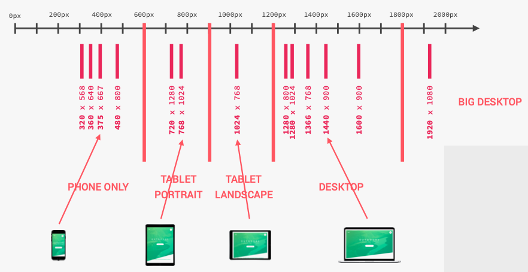

---

## Responsive Images
Tho goal of responsive images is to serve the right image to the right screen size and device, in order to avoid downloading unnecessary large images on smaller screens.

### When to use responsive images: The 3 use cases.
#### Resolution Switching:

<p align="center">
  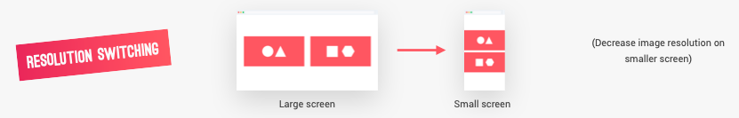
</p>

```html
<!-- 170px/900 ~= 20vw, 170px/600 ~= 30vw, 300px default width -->
<!-- src = for browsers that not support srcset, sizes -->

```
Use the **width descriptor** (300w, 1000w): Inform to the browser of the width of these images without having to download them to get access to the information.

**sizes attr**: Inform the browser about the approximate width of the image at different viewport width. i.e. In screen max-width: 900px the image will have width: 170px. With both information, the browser can figure out which is the perfect image to use for the current viewport width and the current display resolution.

#### Density Switching

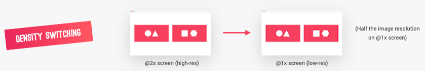

Serve a large version of the same image for high resolution screens and serve a smaller version of the same image for a low density screen.
```html

```
1x, 2x are the density descriptors.

**srcset** allows the browser to choose the best of these two images according the to screen that is used by the user to display the webpage. So if it's a low density screen, it will use the 1x image and if it's a high density screen, it'll use the 2x image.

#### Art Direction

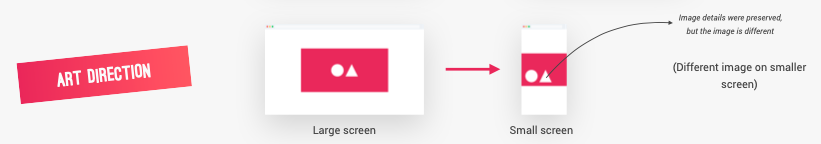

Use a HTML element *picture* which we can specify multiple sources for one image, and then in the source element, we can write a media query like in CSS. It's art direction, different images for different viewport width.
```html
<!-- Force the browser to use the source image in case that the media query applies -->
<picture class="footer__logo">
  <source srcset="img/logo-green-small-1x.png 1x, img/logo-green-small-2x.png 2x" media="(max-width: 37.5em)">
  
</picture>
```

### Responsive images in CSS
```scss
// Target resolution
@media only screen and (min-resolution: 192dpi) and (min-width: 37.5em),
    only screen and(-webkit-min-device-pixel-ratio: 2) and (min-width: 37.5em),
    only screen and(min-width: 125em) {
  background-image: linear-gradient(
    to right bottom,
    rgba($color-primary-light, 0.8),
    rgba($color-primary-dark, 0.8)
  ),
  url(../img/hero.jpg);
}
```
192 dpi(dots per inch): Resolution of the Apple retina screen.

Whenever resolution is higher than 192 dpi and width is larger than 600px, or when de width is larger to 2000px then the code below is applied. -webkit-min-device-pixel-ratio: 2 for safari

---

## Simple Build Process
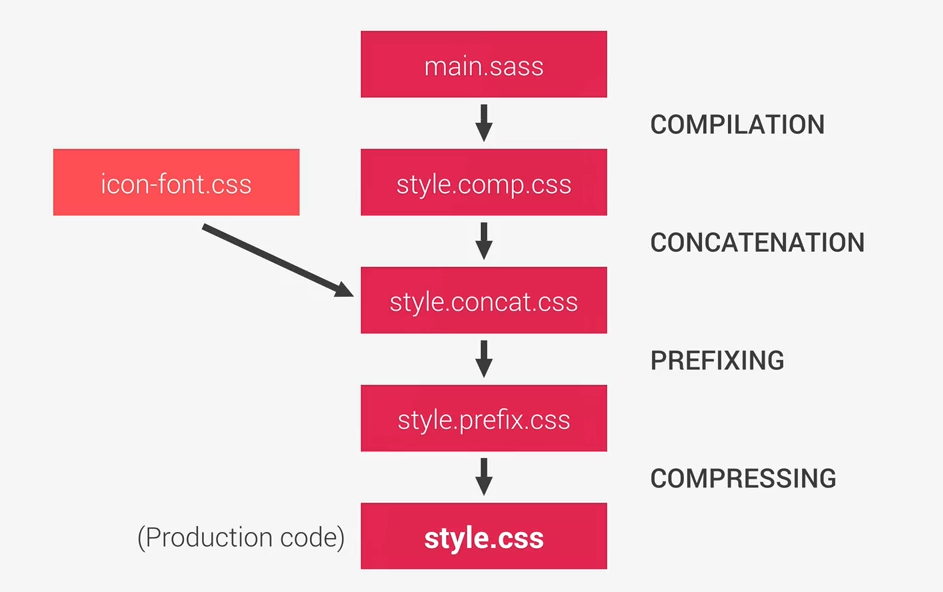

---

## Warning
Many of the new CSS features are highly experimental and only work in top modern browsers.
* Check [caniuse.com](https://www.caniuse.com) before using a modern CSS property in production.
* Use graceful degradation with @supports.

---

## CSS Notes

#### Universal Selector
```css
/* Universal selector for normalized the CSS in order to make a cross browser reset */
*,
*::after,
*::before {
  margin: 0;
  padding: 0;
  /* Inherit box-sizing: border-box from body element for each element insise body */
  box-sizing: inherit;
}
```

#### Font-size
```css
html {
  /* This defines what 1rem is */
  /* default font-size is 16px */
  /* if font-size is specified in pixels then the user cant override the size manually in the browser settings  */
  /* font-size: 10px; */
  /* Is better practice use % based on default font-size (16px) (10px = 62.5% from 16px) */
  font-size: 62.5%;
}
```

#### Media Queries Manager
```scss
/*
MEDIA QUERIES MANAGER

0px     600px:      Phone
600px   900px:    Tablet portrait
900px   1200px:   Tablet landscape
1200px  1800px:  Normal styles apply
1800px+ :         Big desktop

$breakpoint argumnet choices:
- phone
- tab-port
- tab-land
- big-desktop

- rem or em in a media query is always just equal to the font size which is coming
- from the browser and that's by default 16 pixels.
- We're going to use ems instead rems because it fails on some browsers.
- Conclusion ems is the best options for media queries

1em = 16px
*/
@mixin respond($breakpoint) {
  @if $breakpoint == phone {
    @media only screen and (max-width: 37.5em) {
      // 600px
      @content;
    }
  }
  @if $breakpoint == tab-port {
    @media only screen and (max-width: 56.25em) {
      // 900px
      @content;
    }
  }
  @if $breakpoint == tab-land {
    @media only screen and (max-width: 75em) {
      // 1200px
      @content;
    }
  }
  @if $breakpoint == big-desktop {
    @media only screen and (min-width: 112.5em) {
      // 1800px
      @content;
    }
  }
}

.element {
  @include respond(phone) {
    ...
  }
  @include respond(tab-port) {
    ...
  }
  @include respond(tab-land) {
    ...
  }
  @include respond(big-desktop) {
    ...
  }
}
```

#### ::selection CSS pseudo-element
The ::selection CSS pseudo-element applies styles to the part of a document that has been highlighted by the user (such as clicking and dragging the mouse across text).
```css
::selection {
  background-color: $color-primary;
  color: $color-white;
}
```

#### Animations
```css
/* Two types of animations in CSS: Keyframes - Transition property */
/* Keyframes */
@keyframes moveInLeft {
  /* specify what i want to happen in each moment of time of the animation */
  /* start */
  0% {
    /* invisible */
    opacity: 0;
    /* Current position to -100px in x axis (move to left side) */
    transform: translateX(-10rem);
  }

  80% {
    /* 0 position to 20px in x axis (move to right side) */
    transform: translateX(1rem);
  }

  /* finish */
  100% {
    opacity: 1;
    /* translate 0 position */
    transform: translate(0);
  }
}

.element {
  /* Animation require two porperties to work */
  animation-name: moveInLeft;
  animation-duration: 2s;

  /* sets how an animation progresses through the duration of each cycle */
  animation-timing-function: ease-out;

  /* shorthand property */
  animation: moveInRight 2s ease-out;

  /* wait for 3s to start the animation */
  animation-delay: 3s;

  /* animation happen three times */
  animation-iteration-count: 3;

  /* styles up to 0%(in animation) before the animations start */
  animation-fill-mode: backwards;
}
```

#### Background image
```scss
.header {
  // 90% of thw viewport height
  height: 90vh;
  // linear gradient use the back-image property
  // to right bottom css understand that it should begin since left up
  // The fourth parameter is the opacity (0.8) in order to see the background image
  background-image: linear-gradient(
      to right bottom,
      rgba($color-primary-light, 0.8),
      rgba($color-primary-dark, 0.8)
    ),
    url(../img/hero-small.jpg);
  // whatever width of the viewport, it'll always try to fit the element inside of the box
  background-size: cover;
  // whatever viewport size the top of the image always stays at the top of the container
  background-position: top;
}
```

#### Gradient to text
```scss
.heading {
  background-image: linear-gradient(
    to right,
    $color-primary-light,
    $color-primary-dark
  );
  // The background gets clipped exactly where the text is.
  // It will clip it to exactly the places where the text sits
  // This background image will only be visible where the text is.
  -webkit-background-clip: text;
  background-clip: text;
  // Make the text transparent in order to see the background image
  color: transparent;
}
```

#### Radial Gradient
```scss
.background {
  // linear-gradient: From one side to the other one
  // radial-gradient: Starts in the middle of an element and goes from there in all the outside directions
  background-image: radial-gradient(
    $color-primary-light,
    $color-primary-dark
  );
  transition: transform 0.8s cubic-bezier(0.86, 0, 0.07, 1);
}
```

#### clip-path property
```scss
.header {
  /* specify the polygon in which the element will still be visible */
  /* It will receive four coordinates (x, y) and it's gonna start at the top left corner an then move clockwise  */
  -webkit-clip-path: polygon(0 0, 100% 0, 100% 70vh, 0 100%);
  clip-path: polygon(0 0, 100% 0, 100% 70vh, 0 100%);
}
```

#### Touch devices
```css
/* Not touch devices */
@media only screen and (hover: none) {
  ...
}
/* Touch devices */
@media only screen and (hover: hover) {
  ...
}
```

#### calc()
```scss
$gutter-horizontal: 8rem;
// calc() is CSS functions for make calculations using mix units
// #{} using sass variable
.col-2-of-4 {
  width: calc(2 * ((100% - 2 * #{$gutter-horizontal}) / 3) + #{$gutter-horizontal});
}
```

#### Pseudo-classes
Special state of a selector
```scss
// :link is pseudo-class -> when it is an anchor element
// :visited when a user has visited a link (purple color default)
.btn {
  &:link,
  &:visited {
    ...
  }
}
```

#### Pseudo-elements
Add a virtual element before or after the element.
```scss
/* pseudo-elements allow us to style certain parts of elements */
/* add an element that looks exactly like the element but it's behind the element */
&::after, &::before {
  /* always necessary */
  content: "";
}
```

#### Shape-outside
Define where the content floats around the element
```scss
.shape {
  width: 15rem;
  height: 15rem;
  // The float property only works if the element has width and height
  float: left;
  // In this case a circle.
  // first parameter: radious of the circle, 50% means half the height and the width of the element
  // the element must be floated in order to work
  -webkit-shape-outside: circle(50% at 50% 50%);
  shape-outside: circle(50% at 50% 50%);
}
```

#### Column layout to text
```scss
.text {
  font-size: 1.4rem;
  margin-bottom: 3rem;

  // Column layout
  column-count: 2;
  column-gap: 2em; // 1em = 14px (current element) (space between 2 columns)
  // The border what is exactly in the middle of these 2 columns
  column-rule: 1px solid $color-grey-light-2;

  // hyphenetion
  -moz-hyphens: auto;
  -ms-hyphens: auto;
  -webkit-hyphens: auto;
  hyphens: auto;
}
```

#### Util input pseudo-classes
```scss
.input {
  &:focus {
    ...
    // Just when the input is focused
    &:invalid {

    }
  }
  &::-webkit-input-placeholder {
    // Change color input placeholder
    color: $color-grey-dark-2;
  }
  // Only shown as soon as we have some text on input
  &:placeholder-shown {
    ...
  }
}
```

### Tricks
* Trick for cut the width of element (not ocuppy 100% of available width)
```scss
// In order to use the box model properties on it like padding, margin, and all that good stuff.
.heading {
  display: inline-block;
}
```

* Apply to all except the last child
```css
.li {
  &:not(:last-child) {
    margin-bottom: 2rem
  }
}
```

* Selector to get all elements in which the class attr starts with the symbol "col-"
```scss
[class^="col-"] {
  margin-bottom: 4rem;
}
```

* Selectors
```scss
// > selector direct child selector will only select the first child.
// * Select all children
& > * {
  transform: skewY(7deg);
}

// + select the sibling element that comes inmediatly AFTER the element (the label needs after the input
.element  + .sibling {
  ...
}

// ~ general sibling selector
.element ~ .sibling {
  ...
}

```

* Ocupy the entire section maintaining the aspect ratio (video)
```scss
.bg-video {
  &__content {
    height: 100%;
    width: 100%;
    // Ocupy the entire section maintaining the aspect ratio
    // object-fit: The element (html elements or videos) fill the entre parent while maintaining its aspect ratio
    object-fit: cover; // similar to background-size: cover
  }
}
```

* Box-shadow
```scss
.element {
  // first: offset in x direction
  // second: offset in y direction
  // third: blur
  // fourth: color
  box-shadow: 0 1rem 2rem rgba($color-black, 0.2);
}
```

* Blend background
```scss
.background {
  background-size: cover;
  height: 23rem;
  // background blend mode property describes how the elements, background images should blend.
  // see other props for achive more effects, i.e. saturation, overlay, lighten, etc.
  background-blend-mode: screen;
}
```